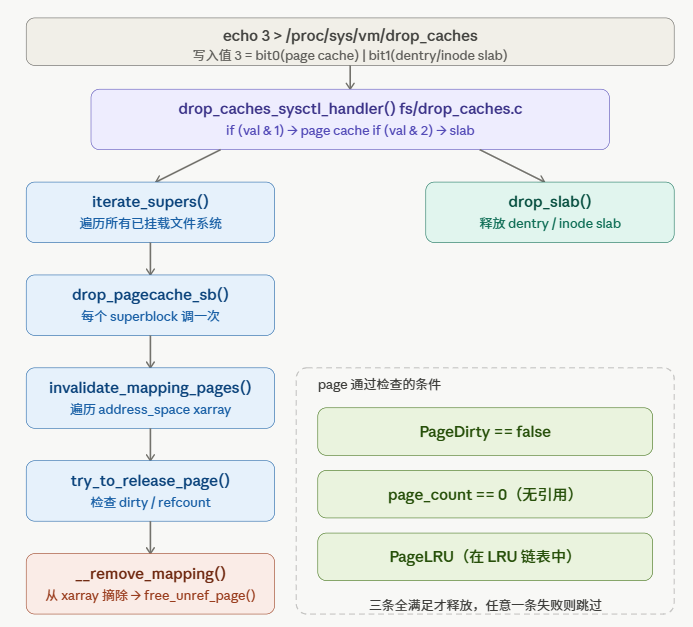
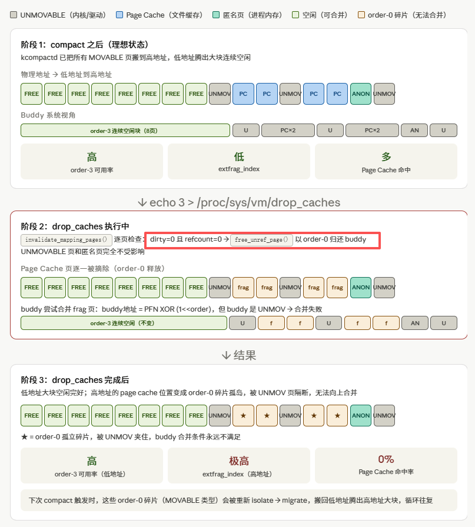
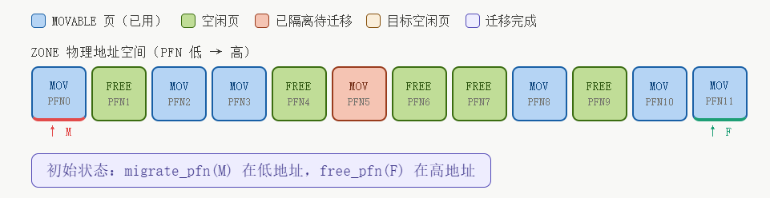
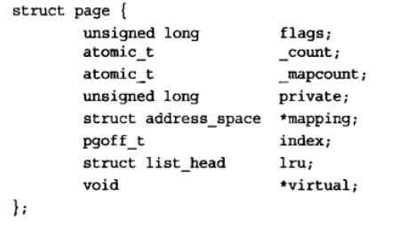
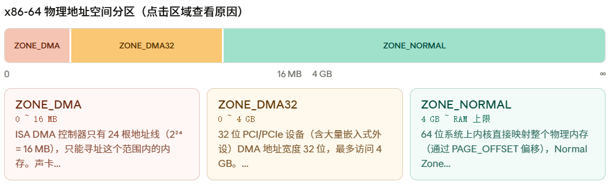

# 1. 内存淘汰机制
| 策略 | 说明 |
|------|------|
| **LRU** | 淘汰最久未使用的 |
| **LFU** | 淘汰使用频率最低的 |
| **FIFO** | 淘汰最先进入的 |
| **Random** | 随机淘汰 |

# 2. drop cache 和 compact 内存回收机制
- **drop cache**：通过 `echo 3 > /proc/sys/vm/drop_caches` 强制释放页缓存、目录项缓存和 inode 缓存，立即回收
伙伴系统要把两个 order-0 合并成 order-1，必须同时满足三个条件：
```
条件1：buddy 地址 = 当前页地址 XOR (1 << order) << PAGE_SHIFT
条件2：buddy 也必须是 FREE 状态
条件3：buddy 的 order 必须 == 当前 order（没有被更大块借用）
```


drop_cache之后，内存现象的根本原因：**free_unref_page() 每次只归还 order-0 单页，归还时 buddy 系统会尝试合并，但合并的充要条件是"配对的 buddy 页也必须空闲"**。Page Cache 页散落在 UNMOVABLE 页之间，buddy 天然被隔断，order-0 碎片就此永久留在高地址区域，直到下次 compaction 把它们作为 MOVABLE 页重新搬走。

- **compact** 压缩 核心：双指针扫描算法

1. *isolate_migratepages()*  — migrate_pfn 向右扫
**从低地址开始找类型为 MIGRATE_MOVABLE 的页（这类页没有固定物理地址要求，可以安全搬走）。找到后把它从 **LRU** 链表摘出，放入 cc->migratepages 链表暂存**。重要：**MIGRATE_UNMOVABLE（内核代码、驱动 DMA buffer 等）的页绝对不能动，遇到就跳过**。
2. isolate_freepages() — free_pfn 向左扫
**从高地址往低地址找连续的空闲块。找到后摘出放入 cc->freepages，作为迁移的目标槽位**。高地址的空闲块越大，迁移后就能在低地址留出更大的连续空间——这正是 compaction 的目的。
3. migrate_pages() — 内容拷贝 + 页表重映射
这一步做两件事：
**把低地址页的内容 memcpy 到高地址目标页
遍历所有持有该页的进程页表，把 PTE（页表项）中的物理地址改成新地址**

### compact 源码路径（从 echo 到合并）
**入口：sysctl handler**
```c
// mm/compaction.c
int sysctl_compaction_handler(...)        // echo 1 > /proc/sys/vm/compact_memory
{
    if (write)
        compact_nodes();                  // 对所有 NUMA 节点执行
}
static void compact_nodes(void)
{
    for_each_populated_zone(zone)         // 逐个 zone：DMA / DMA32 / Normal
        compact_zone_order(zone, MAX_ORDER - 1, ...);
}
```

**核心循环：两个游标相遇即停**
```c
// mm/compaction.c
static enum compact_result compact_zone(struct compact_control *cc, ...)
{
    while (compact_finished(cc) == COMPACT_CONTINUE) {
        isolate_migratepages(cc);   // ① migrate_pfn 向右扫，摘 MOVABLE 页入 cc->migratepages
        // isolate_freepages(cc);   // ② free_pfn 向左扫，摘高地址空闲页入 cc->freepages
        migrate_pages(&cc->migratepages,
                      compaction_alloc,   // 从 cc->freepages 取目标槽位
                      compaction_free,
                      MIGRATE_SYNC_LIGHT, ...);   // ③ 拷贝 + 改 PTE
    }
}
```
```text
zone 物理地址空间（低 → 高）
 [used][free][used][used][free][used][free][free][used]
   ↑ migrate_pfn（向右找可搬的页）        ↑ free_pfn（向左找空槽）
 两个游标相遇 → 本轮 compaction 结束
```

**迁移后：腾出的页归还伙伴系统，自动向上合并**
```c
// mm/migrate.c → free_unref_page() → __free_one_page()
static inline void __free_one_page(struct page *page, unsigned long pfn,
                                   struct zone *zone, unsigned int order, ...)
{
    while (order < MAX_ORDER - 1) {
        buddy_pfn = __find_buddy_pfn(pfn, order);   // 算出伙伴页号
        buddy = page + (buddy_pfn - pfn);
        if (!page_is_buddy(page, buddy, order))     // 伙伴被占用 → 停
            break;
        del_page_from_free_list(buddy, zone, order);// 伙伴也空闲 → 摘下合并
        combined_pfn = buddy_pfn & pfn;
        page = page + (combined_pfn - pfn);
        pfn = combined_pfn;
        order++;                                     // 升一阶，继续往上试
    }
    add_to_free_list(page, zone, order, migratetype);// 最终挂入 free_area[order]
}
```
低地址端被搬空后连成大块，伙伴系统逐级合并 → 高 order 链表重新有货。

### 为什么 order-10 (4MB) 永远还剩 ~22% 凑不出
4MB 需要 1024 个连续页，**只要中间夹一个 UNMOVABLE 钉子户就全毁**：
```text
低地址 ───────────────────────────────────── 高地址
 [ FREE ×512 ][ UNMOVABLE(pinned) ][ FREE ×511 ]
                     ↑
       一颗钉子把 4MB 劈两半，两半都凑不成 order-10
```
UNMOVABLE 页来源：内核代码页、`mlock()` 锁定页、DMA 缓冲区、部分 slab 对象——compaction 不能动它们，这是物理上限，不是没整理干净。

### drop_caches 与 compact 的分工（实验2 结论的本质）
| | drop_caches=3 | compact_memory=1 |
|---|---|---|
| 入口 | `fs/drop_caches.c` | `mm/compaction.c` |
| 动作 | page cache 以 order-0 散还伙伴系统 | 双指针搬 MOVABLE 页，腾低地址连续空间 |
| 短期碎片 | 变**差**（order-0 涌入） | 变**好**（连续化+合并） |
| 角色 | 提供原材料（更多空闲页） | 把散料拼成大块 |

→ 单用 drop_caches 反而添乱，必须配 compact 一起用。

# 3. mmu
- **MMU = Memory Management Unit = 内存管理单元**: 负责把**虚拟地址** → 翻译成 → **物理地址**
## 硬件一：**TLB（Translation Lookaside Buffer）快表**
```
本质：地址翻译的"缓存"
┌─────────────────────────────────────┐
│              TLB                     │
│  虚拟页号      →    物理页号          │
│  0x7fff1      →    0x3a2b1          │
│  0x7fff2      →    0x1c3d2          │
│  0x40001      →    0x9f001          │
└─────────────────────────────────────┘
容量很小（几十~几百条），但速度极快（和CPU一样快）
TLB 里存的是：
  "最近访问过的虚拟页" 的翻译结果
无法手动控制，硬件自动决定：
  ✅ 最近用过的  →  在 TLB
  ❌ 很久没用的  →  被淘汰出 TLB
  ❌ 进程切换后  →  全部清空重来
```
**工作流程：**
```
CPU 访问虚拟地址
       ↓
  先查 TLB ──→ 命中（TLB Hit）  → 直接拿到物理地址 ✅ 快！
       ↓
  未命中（TLB Miss）
       ↓
  去查页表（慢）→ 找到后存入TLB → 下次就快了
```
---
## 硬件二：**页表遍历器（Page Table Walker）**

```
本质：TLB没命中时，自动去内存里查页表的硬件电路
页表存在内存里：
┌──────────────────────────────────────┐
│              内存                     │
│                                      │
│  页表：                               │
│  [虚拟页0] → 物理页 0x001            │
│  [虚拟页1] → 物理页 0x3a2            │
│  [虚拟页2] → 物理页 0x7f1            │
│  ...                                 │
└──────────────────────────────────────┘
         ↑
   Page Table Walker 自动来这里查
```
**现代系统是多级页表（x86_64 是4级）：**
```
虚拟地址拆分：
┌────────┬────────┬────────┬────────┬──────────┐
│  PGD   │  PUD   │  PMD   │  PTE   │  偏移量   │
│ 9 bits │ 9 bits │ 9 bits │ 9 bits │ 12 bits  │
└────────┴────────┴────────┴────────┴──────────┘

Walker 按顺序查4张表，最终找到物理地址
CR3寄存器 → PGD表 → PUD表 → PMD表 → PTE表 → 物理页
```

---

### 🔄 完整流程图

```
CPU 要访问虚拟地址 0x7fff1234
           ↓
┌─────────────────────┐
│  查 TLB              │
└──────┬──────────────┘
       ├── 命中 ──────────────────────→ 得到物理地址 ✅
       │
       └── 未命中
               ↓
    ┌──────────────────────┐
    │  Page Table Walker   │
    │  CR3→PGD→PUD→PMD→PTE │  ← 在内存里走4步
    └──────────┬───────────┘
               ↓
          得到物理地址
               ↓
          结果存入TLB（下次快）
               ↓
          返回物理地址 ✅
```

---

### 📊 两个硬件对比

| | TLB | Page Table Walker |
|--|-----|------------------|
| **本质** | 地址翻译缓存 | 页表查询硬件 |
| **速度** | 极快（1~几个周期） | 慢（几十~几百周期）|
| **容量** | 小（几十~几百条） | 无限（查内存中的页表）|
| **触发时机** | 每次地址翻译先查它 | TLB未命中时才启动 |

---

### 💡 一句话总结

```
MMU = TLB（快但容量小的缓存）+ Page Table Walker（慢但全的页表查询器）

先查TLB，查到了快速返回；
查不到再让Walker去内存里翻页表，翻完再填入TLB。
```
# 4. 页和区
## 概念区别
- Page 是 Linux 管理物理内存的最小单位(4KB)；Zone 是把 Page 按“硬件能不能用、内核方不方便直接访问”分出来的池子。
## page 页
- 每个物理页，内核都会用一个 struct page 结构体描述


这个页空闲吗？
被谁使用？
引用计数是多少？
属于哪个 zone？
是不是页缓存？
是不是匿名页？
能不能回收？

- alloc_pages(gfp_mask, order)
返回的是：struct page * 页的描述符

- __get_free_pages(gfp_mask, order)
返回的是：unsigned long 也就是这块内存在内核虚拟地址空间里的地址。

- 内核要管理页缓存、页表、物理页状态，常用 struct page *。
如果只是想得到一段内核能直接读写的连续内存，就可能用 __get_free_pages() 这种返回地址的接口。

- **order 表示 2 的 order 次方个连续页，要求的是---连续物理页**
## Zone 区
- 有些设备只能访问低地址内存；有些内存内核可以直接访问；有些内存虽然存在，但 32 位内核不能一直直接映射它。于是 Linux 把 page 分到不同的 zone 里。


# 5. kmalloc 
## 5.1 重要框架图
```
物理内存
  ↓ 切成 page
buddy allocator
  ↓ 分配 1 个或多个 page
slab/slub allocator
  ↓ 把 page 切成小对象
kmalloc/kzalloc/kmem_cache_alloc
  ↓
内核代码拿到 32B、64B、128B、struct xxx 这样的对象
```
- buddy allocator 负责按页分配，比如 4KB、8KB、16KB
slab/slub allocator 负责把页切成小块，比如 32B、64B、128B
kmalloc() 对外提供按字节申请的接口
- slab/slub allocator 就是 Linux 内核把“按页管理的物理内存”转换成“按小对象分配的内核内存”的中间层。
- **因为依赖伙伴系统和slab分配层，所以分配的内核内存是连续的**

## 5.2 源码解析
```c
static __always_inline
void *__do_kmalloc_node(size_t size, kmem_buckets *b, gfp_t flags, int node,
                        unsigned long caller)
{
    struct kmem_cache *s;
    void *ret;

    if (unlikely(size > KMALLOC_MAX_CACHE_SIZE)) {
        ret = __kmalloc_large_node_noprof(size, flags, node);
        return ret;
    }

    if (unlikely(!size))
        return ZERO_SIZE_PTR;

    s = kmalloc_slab(size, b, flags, caller);

    ret = slab_alloc_node(s, NULL, flags, node, caller, size);
    return ret;
}

代码解析：
1. 如果 size 太大，走大块分配，直接按页分配
2. 如果 size 为 0，返回特殊指针 ZERO_SIZE_PTR
3. 普通小对象：通过 kmalloc_slab(size) 找合适的 slab cache
4. 从这个 slab cache 里分配一个对象

kmalloc(100)
  -> 选择 kmalloc-128
  -> slab_alloc_node()
  -> 如果有空闲 128B 对象，直接返回
  -> 如果没有，alloc_slab_page()
  -> buddy allocator 分配 4KB 或更多页
  -> SLUB 把页切成多个 128B 对象
  -> 返回一个对象地址
```
# 6. malloc vs kmalloc

## 6.1 **kmalloc 和 vmalloc 的核心区别**

`kmalloc()` 分配的是 **虚拟地址连续、物理地址也连续** 的内核内存，适合小块或中等大小的分配，速度快，常用于内核对象、驱动缓冲区以及可能涉及 DMA 的场景。释放时使用 `kfree()`。

`vmalloc()` 分配的是 **虚拟地址连续、物理地址不一定连续** 的内核内存。它通过页表把分散的物理页映射成一段连续的内核虚拟地址，因此更适合申请大块内存。释放时使用 `vfree()`。


## 6.2 对比表：

| 特性 | `kmalloc()` | `vmalloc()` |
|---|---|---|
| 虚拟地址 | 连续 | 连续 |
| 物理地址 | 连续 | 不一定连续 |
| 适合场景 | 小块、中块、驱动、DMA 缓冲 | 大块内核缓冲区 |
| 分配速度 | 快 | 较慢 |
| 大块分配成功率 | 较低，受物理碎片影响 | 较高，可用分散物理页 |
| 释放函数 | `kfree()` | `vfree()` |

## 6.3 补充理解：

```text
kmalloc 小对象：来自 slab/slub cache
kmalloc 大对象：直接向页分配器申请多个连续页
vmalloc：申请多个分散页，再建立连续虚拟映射
```


